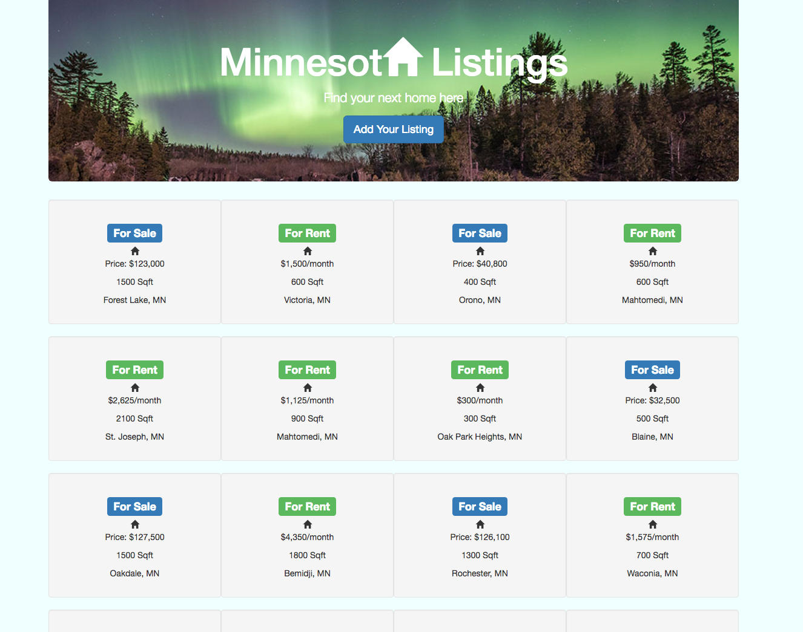

# [Minnesota Listings](https://minnesota-listings.herokuapp.com/)

This weekend challenged uses the MEAN stack and the OMDB API to create an application that can search for movies. A user can also store their favorites in the database, as well as delete a stored favorite.

This challenge introduces AngularJS and the concept of using Controllers and Factories.

****UPDATE: OMDB API is no longer free so this application currently does connect to OMDB API.



## Getting Started

These instructions will get you a copy of the project up and running on your local machine for development and testing purposes.

### Prerequisites

You will need to have the following software installed.

```
Node.js (https://nodejs.org/en/)
```

```
MongoDB (https://www.mongodb.com/)
```

```
Robomongo (https://robomongo.org/)
```

### Installing

Steps to get the development environment running.

1. Clone the repository to your local machine.

```
git clone https://github.com/BetsyRowley/weekend_challenge5.git
```

2. Install all dependencies.

```
npm install
```

2. Ensure MongoDB is running.

```
mongod
```

3. Start Grunt.

```
grunt
```

4. Spin up the Server.

```
npm start
```

5. Open in the browser.

```
localhost:8000
```

## Built With

* MongoDB
* Express.js
* AngularJS
* Node.js
* Grunt
* HTML5
* CSS3
* Bootstrap
* Heroku
* mLabs


## Authors

* [**Betsy Rowley**](https://github.com/BetsyRowley)

## Acknowledgments

* Prime Digital Academy Instructors Chris Black and Scott Bromander for their on-going support.
